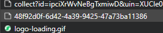

# rev_HunYuan
使用Python, requests，用于快速将腾讯混元接入项目

### 声明
rev_HunYuan 专案，包括其开发者、贡献者及相关个人或实体，在此明确声明不与任何形式的非法行为有任何关联、支持或认可。此免责声明延伸至任何可能违反当地、国家或国际法律、法规或道德准则的 rev_HunYuan 专案使用或应用。

rev_HunYuan 是一个开放原始码软体专案，其目的在于促进合法且符合道德规范的应用。每个用户都有责任确保其对 rev_HunYuan 的使用符合其管辖范围内的所有适用法律和法规。

rev_HunYuan 的开发者和贡献者对用户违反法律或从事任何形式非法活动的行为不承担任何责任。用户对自己的行为以及使用 rev_HunYuan 可能产生的任何后果负全部责任。

此外，rev_HunYuan 社群（包括其开发者、贡献者和使用者）所提供的任何讨论、建议或指导，都不应视为法律建议。我们强烈建议使用者寻求独立的法律顾问，以瞭解其行为的法律影响，并确保遵守相关法律法规。

使用或存取 rev_HunYuan 即表示使用者承认并同意免除开发者、贡献者及相关个人或实体因使用或滥用本专案所产生的任何及所有责任，包括因其行为所产生的任何法律后果。

请依法负责地使用 rev_HunYuan。

## 使用
### 安装
```commandline
pip install -U rev_HunYuan
```

### 基本使用
```python
from rev_HunYuan import *
bot = HunYuan(cookie="your_cookies_here")

result = bot.ask(prompt="你好", # 要发送的内容
                 model="gpt_175B_0404" # 使用的模型，一般无需填写
                 )
```
#### 获取cookie
1. 前往[腾讯混元](https://hunyuan.tencent.com/)，登录你的账号；
2. 打开”开发者工具“（F12），转到”网络“，随便发条消息；
3. 找到如图请求：（48f92d0f-6d42-4a39-9425-47a73ba11386）；
4. 在右侧”请求标头“一栏，找到”Cookie“，将其内容完整的复制下来即可。